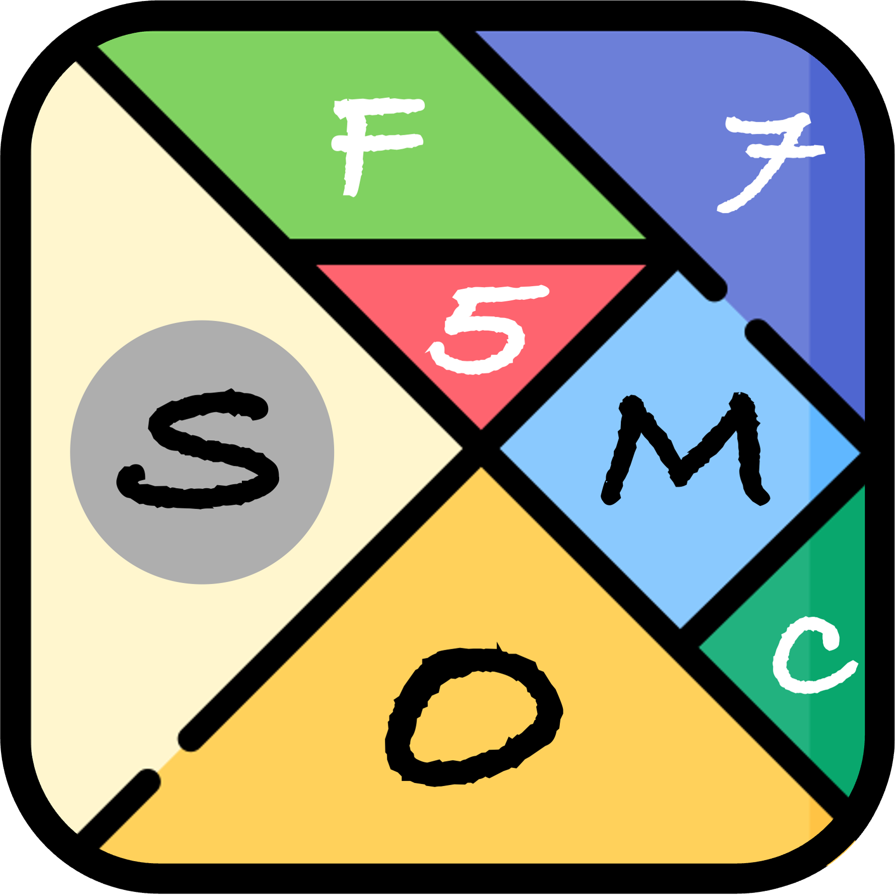
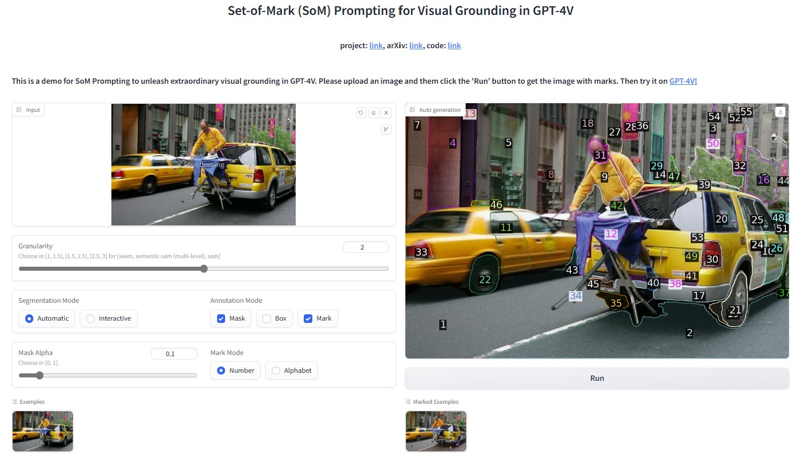

#  Set-of-Mark Visual Prompting for GPT-4V

:grapes: \[[Read our arXiv Paper](https://arxiv.org/pdf/2310.11441.pdf)\] &nbsp; :apple: \[[Project Page](https://som-gpt4v.github.io/)\] 

[Jianwei Yang](https://jwyang.github.io/)\*⚑, [Hao Zhang](https://haozhang534.github.io/)\*, [Feng Li](https://fengli-ust.github.io/)\*, [Xueyan Zou](https://maureenzou.github.io/)\*, [Chunyuan Li](https://chunyuan.li/), [Jianfeng Gao](https://www.microsoft.com/en-us/research/people/jfgao/)

\* Core Contributors &nbsp;&nbsp;&nbsp;&nbsp; ⚑ Project Lead

### Introduction

We present **S**et-**o**f-**M**ark (SoM) prompting, simply overlaying a number of spatial and speakable marks on the images, to unleash the visual grounding abilities in the strongest LMM -- GPT-4V. **Let's using visual prompting for vision**!


### GPT-4V + SoM Demo

https://github.com/microsoft/SoM/assets/3894247/8f827871-7ebd-4a5e-bef5-861516c4427b

### 🔥 News
* [04/25] We release SoM-LLaVA, with a new dataset to empower open-source MLLMs with SoM Prompting. Check it out! [SoM-LLaVA](https://github.com/zzxslp/SoM-LLaVA)
* [11/21] Thanks to Roboflow and @SkalskiP, a [huggingface demo](https://huggingface.co/spaces/Roboflow/SoM) for SoM + GPT-4V is online! Try it out!
* [11/07] We released the vision benchmark we used to evaluate GPT-4V with SoM prompting! Check out the [benchmark page](https://github.com/microsoft/SoM/tree/main/benchmark)!

* [11/07] Now that GPT-4V API has been released, we are releasing a demo integrating SoM into GPT-4V! 
```bash
export OPENAI_API_KEY=YOUR_API_KEY
python demo_gpt4v_som.py
```

* [10/23] We released the SoM toolbox code for generating set-of-mark prompts for GPT-4V. Try it out!

### 🔗 Fascinating Applications

Fascinating applications of SoM in GPT-4V:
* [11/13/2023] [Smartphone GUI Navigation boosted by Set-of-Mark Prompting](https://github.com/zzxslp/MM-Navigator)
* [11/05/2023] [Zero-shot Anomaly Detection with GPT-4V and SoM prompting](https://github.com/zhangzjn/GPT-4V-AD)
* [10/21/2023] [Web UI Navigation Agent inspired by Set-of-Mark Prompting](https://github.com/ddupont808/GPT-4V-Act)
* [10/20/2023] [Set-of-Mark Prompting Reimplementation by @SkalskiP from Roboflow](https://github.com/SkalskiP/SoM.git)

### 🔗 Related Works

Our method compiles the following models to generate the set of marks:

- [Mask DINO](https://github.com/IDEA-Research/MaskDINO): State-of-the-art closed-set image segmentation model
- [OpenSeeD](https://github.com/IDEA-Research/OpenSeeD): State-of-the-art open-vocabulary image segmentation model
- [GroundingDINO](https://github.com/IDEA-Research/GroundingDINO): State-of-the-art open-vocabulary object detection model
- [SEEM](https://github.com/UX-Decoder/Segment-Everything-Everywhere-All-At-Once): Versatile, promptable, interactive and semantic-aware segmentation model
- [Semantic-SAM](https://github.com/UX-Decoder/Semantic-SAM): Segment and recognize anything at any granularity
- [Segment Anything](https://github.com/facebookresearch/segment-anything): Segment anything

We are standing on the shoulder of the giant GPT-4V ([playground](https://chat.openai.com/))!

### :rocket: Quick Start

* Install segmentation packages

```bash
# install SEEM
pip install git+https://github.com/UX-Decoder/Segment-Everything-Everywhere-All-At-Once.git@package
# install SAM
pip install git+https://github.com/facebookresearch/segment-anything.git
# install Semantic-SAM
pip install git+https://github.com/UX-Decoder/Semantic-SAM.git@package
# install Deformable Convolution for Semantic-SAM
cd ops && bash make.sh && cd ..

# common error fix:
python -m pip install 'git+https://github.com/MaureenZOU/detectron2-xyz.git'
```

* Download the pretrained models

```bash
sh download_ckpt.sh
```

* Run the demo

```bash
python demo_som.py
```

And you will see this interface:



## Deploy to AWS

To deploy SoM to EC2 on AWS via Github Actions:

1. Fork this repository and clone your fork to your local machine.
2. Follow the instructions at the top of `deploy.py`.

### :point_right: Comparing standard GPT-4V and its combination with SoM Prompting


### :round_pushpin: SoM Toolbox for image partition

Users can select which granularity of masks to generate, and which mode to use between automatic (top) and interactive (bottom). A higher alpha blending value (0.4) is used for better visualization.
### :unicorn: Interleaved Prompt
SoM enables interleaved prompts which include textual and visual content. The visual content can be represented using the region indices.


### :medal_military: Mark types used in SoM

### :volcano: Evaluation tasks examples


## Use case
### :tulip: Grounded Reasoning and Cross-Image Reference


In comparison to GPT-4V without SoM, adding marks enables GPT-4V to ground the
reasoning on detailed contents of the image (Left). Clear object cross-image references are observed
on the right.
17
### :camping: Problem Solving


Case study on solving CAPTCHA. GPT-4V gives the wrong answer with a wrong number
of squares while finding the correct squares with corresponding marks after SoM prompting.
### :mountain_snow: Knowledge Sharing


Case study on an image of dish for GPT-4V. GPT-4V does not produce a grounded answer
with the original image. Based on SoM prompting, GPT-4V not only speaks out the ingredients but
also corresponds them to the regions.
### :mosque: Personalized Suggestion


SoM-pormpted GPT-4V gives very precise suggestions while the original one fails, even
with hallucinated foods, e.g., soft drinks
### :blossom: Tool Usage Instruction

Likewise, GPT4-V with SoM can help to provide thorough tool usage instruction
, teaching
users the function of each button on a controller. Note that this image is not fully labeled, while
GPT-4V can also provide information about the non-labeled buttons.

### :sunflower: 2D Game Planning


GPT-4V with SoM gives a reasonable suggestion on how to achieve a goal in a gaming
scenario.
### :mosque: Simulated Navigation


### :deciduous_tree: Results
We conduct experiments on various vision tasks to verify the effectiveness of our SoM. Results show that GPT4V+SoM outperforms specialists on most vision tasks and is comparable to MaskDINO on COCO panoptic segmentation.


## :black_nib: Citation

If you find our work helpful for your research, please consider citing the following BibTeX entry.   
```bibtex
@article{yang2023setofmark,
      title={Set-of-Mark Prompting Unleashes Extraordinary Visual Grounding in GPT-4V}, 
      author={Jianwei Yang and Hao Zhang and Feng Li and Xueyan Zou and Chunyuan Li and Jianfeng Gao},
      journal={arXiv preprint arXiv:2310.11441},
      year={2023},
}
```
